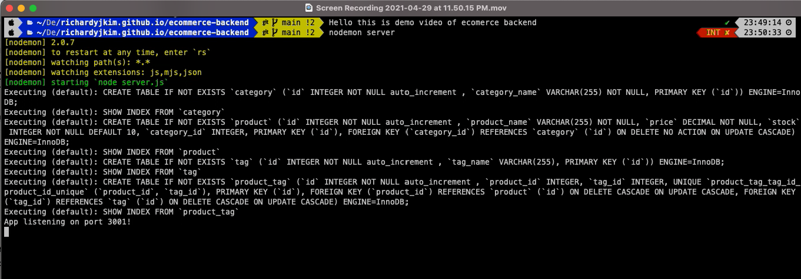
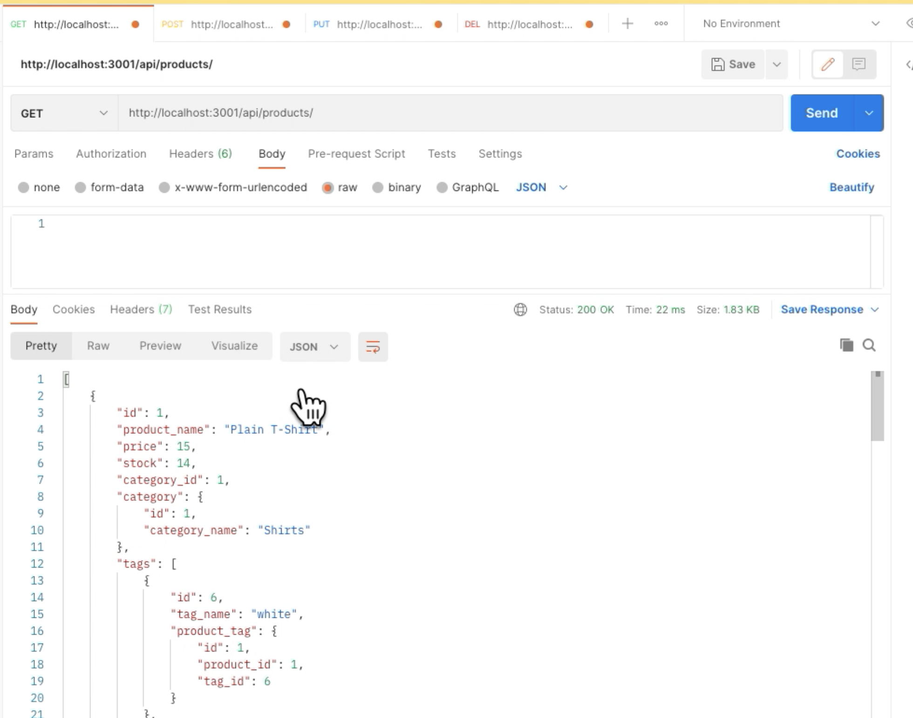
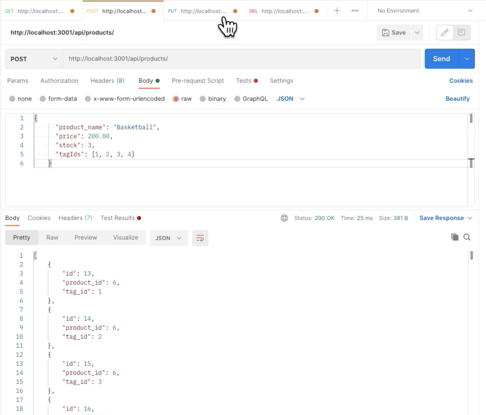
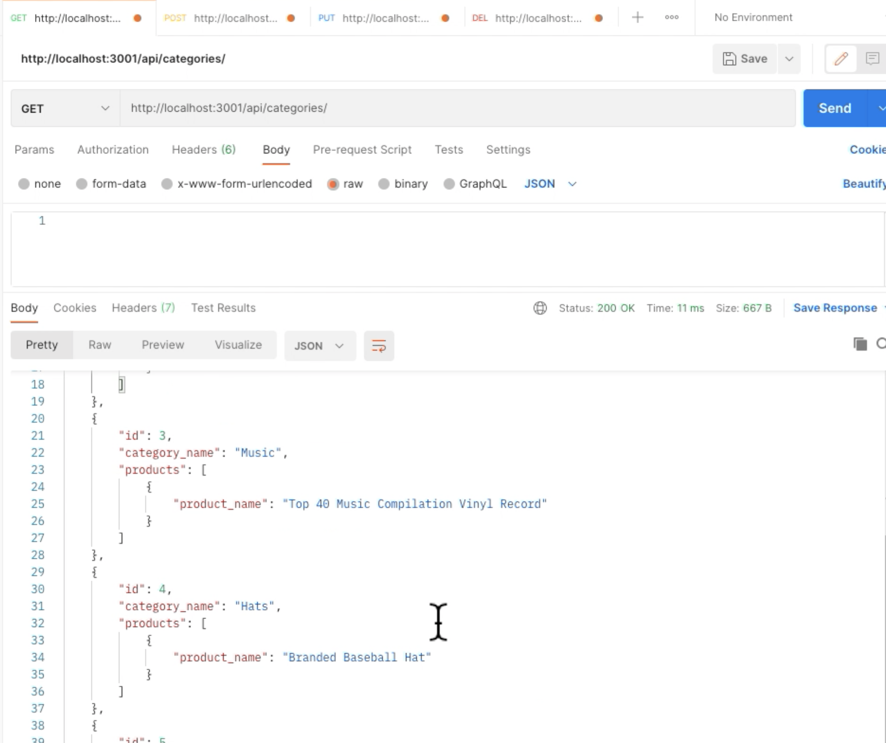
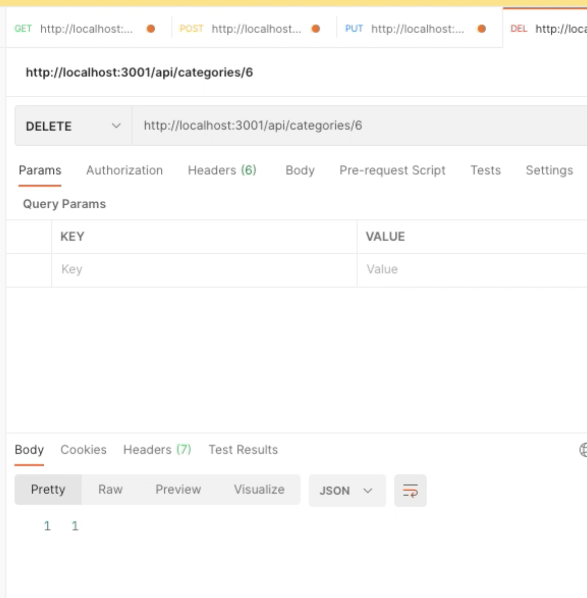
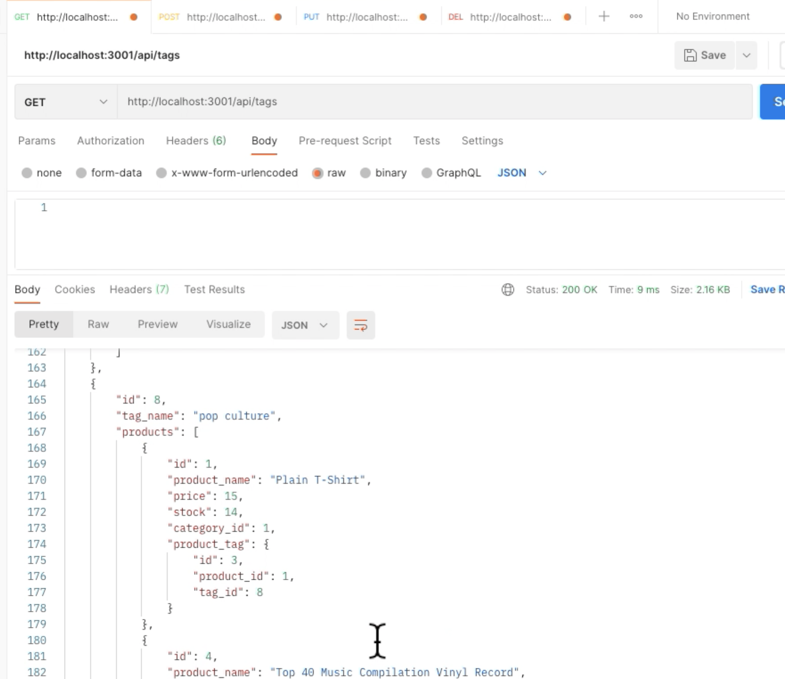
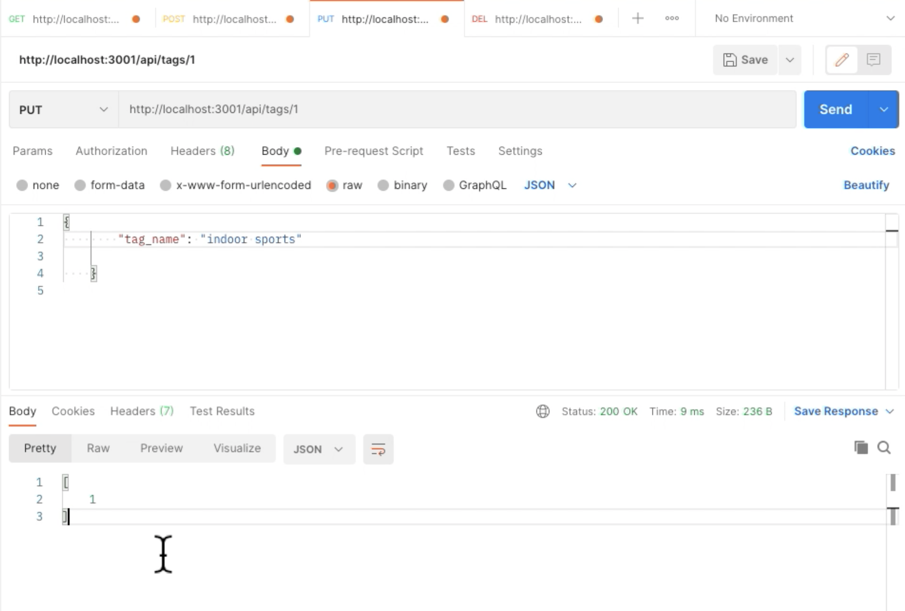
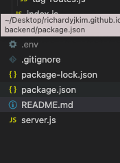

### 13. Object-Relational Mapping (ORM) Challenge: E-commerce Back End

## Description 

Internet retail, also known as e-commerce, is the largest sector of the electronics industry, having generated an estimated US$29 trillion in 2017 (Source: United Nations Conference on Trade and Development). E-commerce platforms like Shopify and WooCommerce provide a suite of services to businesses of all sizes. Due to the prevalence of these platforms, developers should understand the fundamental architecture of e-commerce sites.

## Table of Contents (Optional)

* [Installation](#installation)
* [Usage](#usage)
* [Technology](#technology)
* [Credits](#credits)
* [License](#license)

## Installation

- Please visit github https://github.com/richardyjkim/ecommerce-backend

## Usage 

- database, mysql table created.

- Data from "products"

- post/put/delete successfully
- watch video for more views

- Data from "categories"

- post/put/delete successfully
- watch video for more views

- Data from "tags"

- post/put/delete successfully
- watch video for more views

- env file to protect sensitive info.

- Further Details please watch Demo Video (located in ./Assets/video)

## Technology
    - Express
    - Npm
    - Java Script
    - nodejs
    - postman
    - Mysql2
    - Sequelizer
    - dotenv

## Credits

 - Richard Kim: richardyjkim (github)

## License

MIT License

Copyright (c) [2021] [Richard Y Kim]

Permission is hereby granted, free of charge, to any person obtaining a copy
of this software and associated documentation files (the "Software"), to deal
in the Software without restriction, including without limitation the rights
to use, copy, modify, merge, publish, distribute, sublicense, and/or sell
copies of the Software, and to permit persons to whom the Software is
furnished to do so, subject to the following conditions:

The above copyright notice and this permission notice shall be included in all
copies or substantial portions of the Software.

THE SOFTWARE IS PROVIDED "AS IS", WITHOUT WARRANTY OF ANY KIND, EXPRESS OR
IMPLIED, INCLUDING BUT NOT LIMITED TO THE WARRANTIES OF MERCHANTABILITY,
FITNESS FOR A PARTICULAR PURPOSE AND NONINFRINGEMENT. IN NO EVENT SHALL THE
AUTHORS OR COPYRIGHT HOLDERS BE LIABLE FOR ANY CLAIM, DAMAGES OR OTHER
LIABILITY, WHETHER IN AN ACTION OF CONTRACT, TORT OR OTHERWISE, ARISING FROM,
OUT OF OR IN CONNECTION WITH THE SOFTWARE OR THE USE OR OTHER DEALINGS IN THE
SOFTWARE.

© 2021 Trilogy Education Services, LLC, a 2U, Inc. brand. Confidential and Proprietary. All Rights Reserved.
